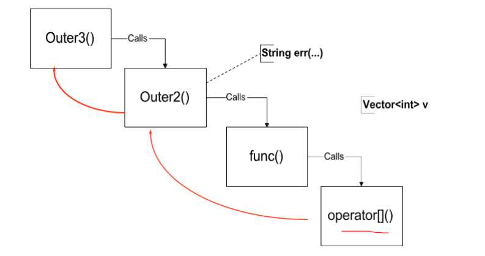
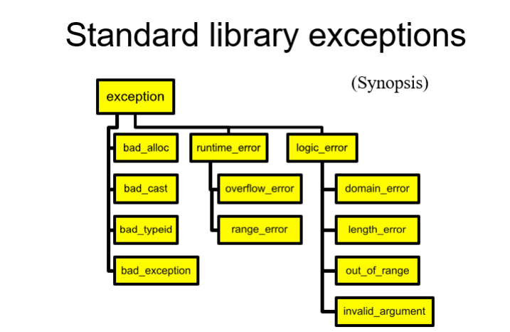
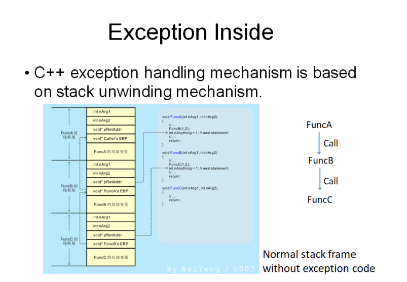
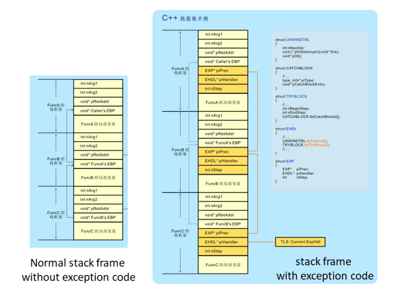
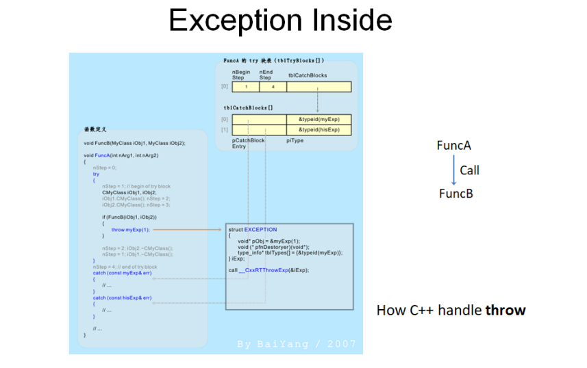
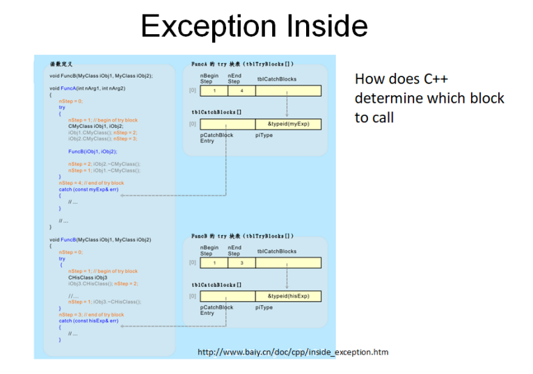

# 目录

[TOC]

# 第10章	Exceptions

## 10.1	Introduction

C++的原则

1.   尽量在编译时，找出可能的错误
2.   代码重用

但是在运行过程中，仍有错误发生，我们需要能够处理未来运行时，可能出现的错误

1.   当出现错误的时候，程序不知道应该如何处理
2.   但是程序知道必须要停止当前进程
3.   让调用者**caller**处理异常

exception的优点

1.   将代码简化
2.   将描述想要执行的代码与执行的代码分开

## 10.2	语法

### 10.2.1	callee扔出异常

1.   **throw**出的是一个**异常对象(class)**

```c++
class VectorIndexError {
public:
	VectorIndexError(int v) : m_badValue(v) { }
	~VectorIndexError() { }
	void diagnostic() {
		cerr << "index " << m_ badValue << "out of range!"; 
    }
private:
	int m_badValue;
};

template <class T>
T& Vector<T>::operator[](int indx){  
  if (indx < 0 || indx >= m_size) {
    throw VectorIndexError(indx);
  }
  return m_elements[indx];
}
```

### 10.2.2	caller处理异常

#### 10.2.2.1	不管异常

```c++
int func() {
	Vector<int> v(12);
	v[3] = 5;
	int i = v[42]; // out of range
	// 下面的代码不会被执行
	return i * 5;
}
```

#### 10.2.2.2	处理异常 try… catch…

1.   **catch**处理哪一类异常，是根据**catch**后面的**异常对象**决定的

```c++
void outer() {
	try {
		func();
	} catch (VectorIndexError& e) {
		e.diagnostic();
		// 对异常的处理到这里截止,代码正常向后执行
	}
	cout << "Control is here after exception";
}
```

#### 10.2.2.3	将异常传递下去

```c++
void outer2(){
    string err("exception caught");
    try {
        func();
    } catch (VectorIndexError) {
        cout << err;
        throw; // 将异常传递下去
        //之后的代码依旧不会执行
    }
}
```

#### 10.2.2.4	处理任意类型的异常

1.   **...**代表任意类型的异常

```c++
void outer3() {
    try	{
   		outer2();
    } catch (...) {
        // ...代表任意类型的异常
    	cout << "The exception stops here!";
    }
}
```



### 10.2.3	总结

**throw**扔出异常

1.   处理器会沿着调用链，找到第一个能够处理异常的程序
2.   在**stack**上的对象，会被正确的析构

**throw exp;**

1.   扔出异常对象，便于**caller**处理

**throw;**

1.   将捕获到的异常再扔出去
2.   只能在**catch**块里面写

**try block**

1.   一个**try**后面可以有任意多个**catch**
2.   每个**catch block**处理不同的异常
3.   如果没有对异常处理的代码，则可以不写**try**

**catch**

1.   一个**try**后面可以有任意多个**catch**
2.   会根据出现的顺序，判断使用哪一个**handler**
3.   对于每一个**handler**
     1.   会先进行精准匹配
     2.   如果精准匹配不成功，会尝试类型转换：如果当前**handler**可以处理当前异常的父类，则会调用这个**handler**
     3.   最后判断当前**handler**是否处理**…**
4.   因此，要**将精确匹配的类型放在前面**

```c++
class A{
    
}
class B : public A{
    
}
void func(){
    try {
        int i = 5;
        throw B();
    } catch (A &a){
        cout << "handler A" << endl;
    } catch (B &b){
        cout << "handler B" << endl;
    } catch (...){
        cout << "handler ..." << endl;
    }
    // 会调用catch(A)
    // 因为处理器是按照顺序进行的,当寻找到catch(A)时,会将B类型转换为A
}
```

### 10.2.4	异常类型的继承

```c++
class MathErr{
    ...
    virtual void diagnostic();
};
class OverflowErr : public MathErr { ... };
class UnderflowErr : public MathErr { ... };
class ZeroDivideErr : public MathErr { ... };

void func{
    try {
        // code to exercise math options
        throw UnderFlowErr();
    } catch (ZeroDivideErr& e) {
        // handle zero divide case
    } catch (MathErr& e) {
        // handle other math errors
    } catch (...) {
        // any other exceptions
    }
}
```

## 10.3	系统自带的异常

### 10.3.1	bad_alloc()：new不成功

```c++
void func() {
	try {
		while(1) {
			char *p = new char[10000];
		}
	} catch (bad_alloc& e) {
        
	}
}
```



## 10.4	定义函数应该扔出的异常

1.   **abc**扔出的异常应该是**MathErr**，相当于要求**abc**函数应该只处理数学问题
2.   在编译时，不会检查
3.   在运行时，如果扔出的异常不是**MathErr**，会扔出**unexpected**异常
4.   规定的异常类型可以是多个

```c++
void abc(int a) throw(MathErr){
    ...
}
Printer::print(Document&) throw(PrinterOffLine, BadDocument){ 
    ... 
}

PrintManager::print(Document&) throw (BadDocument) {
    ...
	// raises or doesn’t handle BadDocument
}

void goodguy() throw () {
	// 不可以扔出异常
}

void average() {
    //没有规定,也不会判断扔出的异常类型
}
```

## 10.5	异常与构造函数、析构函数

判断构造是否成功

1.   使用一个**uninitialized flag**
2.   将申请内存的操作延后到**Init()**函数
3.   扔出一个异常

异常与构造函数

1.   初始化所有成员对象
2.   将所有的指针初始化为**NULL**
3.   不进行申请资源的操作，如打开文件、申请内存、连接网络
4.   在**Init()**函数中申请资源

异常与析构函数

1.   由于析构函数本来就是退栈过程，因此不能在析构函数中扔出异常
2.   如果扔出异常，会触发**std::terminate()**异常
3.   通过异常退出析构函数，是不合法的

## 10.6	使用异常编程

1.   **throw**的如果是**new**出的对象，要记着在**catch**中**delete**

     ```c++
     try {
       throw new Y();
     }	catch(Y* p) {
       // whoops, forgot to delete..
     }
     ```

2.   建议**catch**引用/指针，而不是对象

     ```c++
     struct X {};
     struct Y : public X {};
     // 不要写成这样
     try {
     	throw Y();
     } catch(X x) {
     	// was it X or Y?
     }
     // 要使用引用or指针
     try {
     	throw Y();
     } catch(X &x) {
     }
     ```

3.   如果一个异常没有被捕获，则会产生**std::terminate()**异常，**terminate()**也可以被拦截

     ```c++
     void my_terminate(){ /* ... */}
     ...
     set_terminate(my_terminate);
     ```

## 10.7	Exception的处理机制







