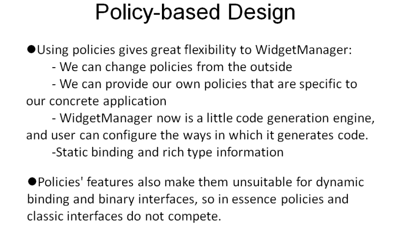

# 目录

[TOC]

# 第12章	Policy-based Design基于策略的设计

## 12.1	The Multiplicity of Software Design

1.   一个问题有很多中正确的解法，不同的解法在不同情况下具有不同的优势
2.   软件需要支持用户的定制，因此需要提供多种情况对应的实现形式

### 12.1.1	例:创建一个对象的策略

```c++
// 直接new一个对象
template <class T>
struct OpNewCreator{
    static T* Create(){
        return new T;
    }
};
// 先分配内存，再调用构造函数
template <class T>
struct MallocCreator{
    static T* Create(){
        void* buf = std::malloc(sizeof(T));
        if (!buf) return 0;
        return new(buf) T;
    }
};
// 从已有对象中复制一个
template <class T>
struct PrototypeCreator {
private:
	T* pPrototype_;
public:
	PrototypeCreator(T* pObj = 0):pPrototype_(pObj){
        
    }
	T* Create() {
		return pPrototype_ ? pPrototype_->Clone() : 0;
	}
    T* GetPrototype() { 
        return pPrototype_; 
    }
    void SetPrototype(T* pObj) { 
        pPrototype_ = pObj;  
    }

};
```

### 12.1.2	通过policy控制内存分配的策略

```c++
// Library code: 用户控制实现哪个类型的分配
template <class CreationPolicy>
class WidgetManager : public CreationPolicy{
	...
};
WidgetManager< OpNewCreator<Widget> > wgtManager;

// Library code: 程序控制实现哪个类型的分配, 用户不需要声明widget的类型信息
template <template <class Created> class CreationPolicy>
class WidgetManager : public CreationPolicy<Widget>{
	...
};
WidgetManager< OpNewCreator> wgtManager;
```

### 12.1.3	使用模板类作为模板参数

```c++
// Library code
template <template <class> class CreationPolicy>
class WidgetManager : public CreationPolicy<Widget>{
	...
    void DoSomething(){
        Gadget* pW = CreationPolicy<Gadget>().Create();
    }
}
```

### 12.1.4	Policy-based Design的优点

1.   使用策略给**WidgetManager**带来了很大的灵活性
     1.   我们可以从外部改变策略
     2.   我们可以提供我们自己的特定于我们具体应用的策略
     3.   **WidgetManager**现在是一个小的代码生成引擎，用户可以配置它生成代码的方式。
2.   策略的特性也使它们不适合动态绑定和二进制接口，所以在本质上策略和经典接口不存在竞争。

 

