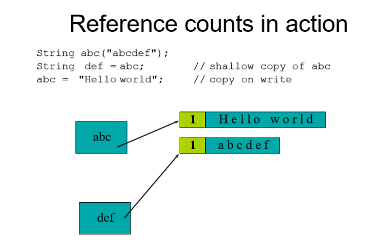

# 目录

[TOC]

# 第13章	SmartPointer

## 13.1	设计目标

1.   记录当前对象被引用了多少次 **reference count**
2.   类**UCObject**用来记录次数，use-counted object
3.   类**UCPointer**用来指向**UCObject**
     1.   智能指针是通过一个类定义的
     2.   使用模板实现
     3.   重载操作符**->**和*****





## 13.2 设计类和接口


1.   **UCObject**：实现**reference count**
2.   **UCPointer**：是一个类模板，支持指向任意一个类型的**UCObject**
3.   **String Rep**：字符串表示的细节，是可共享的
4.   **String**：再封装一层，提供给用户

## 13.3	实现细节

1. **UCObject**

   ```c++
   #include <assert.h>
   class UCObject {
   private:
   	int m_refCount;
   public:
   	UCObject() : m_refCount(0) { }
       UCObject(const UCObject&) : m_refCount(0) { }
       
       // 析构函数需要是virtual的,因为使用的时候,我们通常会使用父类指针指向子类,但是析构的时候要正确调用子类的析构函数
   	virtual ~UCObject() { 
           assert(m_refCount == 0);
       };
   	
       // 接口不需要virtual, 因为所有子类的这些操作都是一样的
       void incr() { 
           m_refCount++; 
       }
   	void decr() {
           m_refCount -= 1;
           if (m_refCount == 0)
               delete this;
       }
   	int references() { 
           return m_refCount; 
       }
   };
   ```

2. **UCPointer**

   ```c++
   template <class T>
   class UCPointer {
   private:
   	T* m_pObj;
       // 下列两个函数表明: T继承自UCObject, 否则调用incr(),decr()时编译器会报错
       // 因为UCPointer要像指针一样使用, 因此将这两个函数放入private中
   	void increment() { 
           if (m_pObj) m_pObj->incr(); 
       }
   	void decrement() { 
           if (m_pObj) m_pObj->decr(); 
       }
   public:
   	UCPointer(T* r = 0): m_pObj(r) { 
           increment();
       }
   	~UCPointer() { 
           decrement(); 
       };
   	UCPointer(const UCPointer<T> & p){
           m_pObj = p.m_pObj;
     		increment();
       }
   	UCPointer& operator=(const UCPointer<T> &){
           if (m_pObj != p.m_Obj){
               decrement();
               m_pObj = p.m_pObj;
               increment();
           }
           return *this;
       }
   	T* operator->() const{
       	return m_pObj;
       }
   	T& operator*() const { 
           return *m_pObj; 
       };
   };
   
   ```

3. 使用实例：假设Shape继承自UCObject

   ```c++
   Ellipse elly(200F, 300F);
   UCPointer<Shape> p(&elly);
   p->render(); // calls Ellipse::render() on  elly!
   ```

4. **String**

   1.   **StringReq**继承自**UCObject**
   2.   **String**提供用户使用的

   ```c++
   class String {
   public:
   	String(const char *);
   	~String();
   	String(const String&);
   	String& operator=(const String&);
   	int operator==(const String&) const;
   	String operator+(const String&) const;
   	int length() const;
   	operator const char*() const;
   private:
   	UCPointer<StringRep> m_rep;
   };
   String::String(const char *s) : m_rep(0) {
   	m_rep = new StringRep(s);
   }
   
   String::~String() {}
   
   // Again, note constructor for rep in list.
   String::String(const String& s) : m_rep(s.m_rep) {}
   
   String& String::operator=(const String& s) {
   	m_rep = s.m_rep; // let smart pointer do work!
   	return *this;
   }
   
   int String::operator==(const String& s) const {
   	// overloaded -> forwards to StringRep
   	return m_rep->equal(*s.m_rep); // smart ptr *
   }
   
   int String::length() const {
   	return m_rep->length();
   }
   ```

5. **StringRep**

   ```c++
   class StringRep : public UCObject {
   public:
   	StringRep(const char *);
   	~StringRep();
   	StringRep(const StringRep&);
   	int length() const{ return strlen(m_pChars); }
   	int equal(const StringRep&) const;
   private:
   	char *m_pChars;
   	// reference semantics -- no assignment op!
   	void operator=(const StringRep&) { }
   };
   StringRep::StringRep(const char *s) {
   	if (s) {
   		int len = strlen(s) + 1;
   		m_pChars = new char[len];
   		strcpy(m_pChars , s);
   	} else {
   		m_pChars = new char[1];
   		*m_pChars = '\0';
   	}
   }
   StringRep::~StringRep() {
   	delete [] m_pChars ;
   }
   StringRep::StringRep(const StringRep& sr) {
   	int len = sr.length();
   	m_pChars = new char[len + 1];
   	strcpy(m_pChars , sr.m_pChars );
   }
   
   int StringRep::equal(const StringRep& sp) const {
   	return (strcmp(m_pChars, sp.m_pChars) == 0);
   }
   ```


## 13.4	细节

1.   **UCPointer**维护了**reference counts**
2.   **UCObject**隐藏了**count**的细节，使得**String**非常干净
3.   **StringReq**只处理字符串的存储和操作
4.   **UCObject**和**UCPointer**是可重用的
5.   当**UCPointer**的对象有环时，对象不会被**delete**