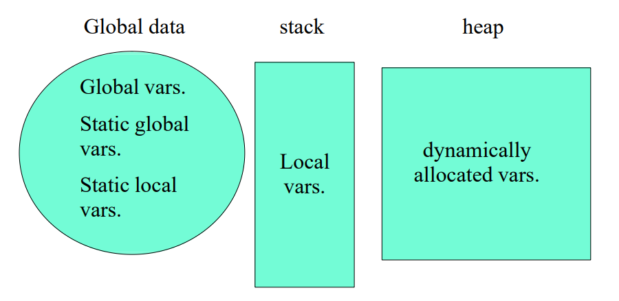

# 目录

[TOC]

# 二、Using Object

## 2.1	string

```c++
#include <string>
using namespace std;
// 定义
string str1 = "Hello", str2, str3;
// 输入、输出
cin >> str1;
cout << str1;
printf("%s", str1.c_str());
// 运算
str2 = str1;
str3 = str1 + str2;
str1 += str2;
str1 += "lalala";
// 构造函数
string s1("Hello"), s2("World");
string(const char *cp, int len);
string(const string& s2, int pos);
string(const string& s2, int pos, int len);
// 子串
substr(int pos, int len);
// 修改串
assign();
insert(const string &s, int len);
insert(int pos, const string &s);
erase();
append();
replace();
// 寻找串
find();
```
## 2.2	File I/O

```c++
#include <fstream>
ofstream File1("C:\\test.txt");
File1 << "Hello World" << endl;

ifstream File2("C:\\test.txt");
string str;
File2 >> str;
```

## 2.3	内存结构



全局变量**Global Vars**：

1. 在函数外定义
2. 可以通过**extern**，分享给不同的***.cpp**文件

**extern**：

1. 声明，在整个工程中会有这样一个变量
2. 声明了变量的类型、名称

**static global var**：

1. 禁止被其他***.cpp**文件访问
2. 包括**static**变量、**static**函数

**static local var**：

1. 保存了在不同次访问函数时，需要被保存的变量
2. 在第一次访问函数时，变量被初始化

## 2.4	Pointers to Objects

```c++
string s = "hello";
string *ps = &s;
```

**&**：取地址

```c++
ps = &s;
```

*****：得到对象

```c++
(*ps).length();
```

**->**：调用函数

```c++
ps->length();
```

两种访问对象的方法

```c++
string s; 	// s是对象本身, 会将对象s进行初始化
string *ps; // ps是指向对象的指针, ps指向的对象不一定存在
```

赋值

```c++
string s1, s2;
s1 = s2;	// 对象本身发生了变化

string *ps1, *ps2;
ps1 = ps2;	// 只是指针的指向发生了变化, 但是对象本身并没有变化
```

## 2.5	动态分配内存

动态分配内存：保存在堆空间

```c++
// 分配内存: new--申请内存, 然后调用对象的构造函数
// 分配内存时, 系统会默认在内存的前面加上一些描述信息, 以便于系统后期回收
new int;
new Stash;
new int[10];

// 删除内存: delete--调用对象的析构函数, 然后释放内存
delete p; 	// 删除一个对象
delete[] p; // 删除数组
```

动态数组：

```c++
int *psome = new int[10];
delete[] psome;
```

注意：

```c++
int *pArr = new int[10];
pArr++;
delete[] pArr; // 这句话是不对的, pArr指向的不仅仅是自身, 还有堆分配的内存的相关信息
```

要求：

1. 不要**delete**不是被**new**分配的内存
2. 不要**delete**同一个内存两次
3. 如果**new []**，要用**delete []**
4. 可以**delete**一个空指针

## 2.6	引用 Reference

用法：对一个已经存在的对象，生成一个新的名字

```c++
// 定义,定义后,访问r <==> 访问c
// 如: r='t' <==> c='t'
char& r = c;
// 应用
void func(int &x); // 在func函数中, 对x的修改会返回
```

例：

```c++
string s1("Hello"), s2("World");
string& rs1 = s1;
rs1 = s2;// 这句话表示将rs1赋值为"World",而非将rs1重新绑定到s2上
```

**Pointers vs References**：

1. **Pointers**

   1. 可以是**null**
   2. 不依赖于已经存在的对象
   3. 可以修改指向不同地址

2. **References**：

   1. 不能是**null**，定义时必须初始化

   2. 依赖于已经存在的对象

   3. 定义后，不能指向其他对象

   4. 指向的对象必须有地址，不能是表达式等临时变量

      ```c++
      void func(int &);
      func(i * 3); // 非法
      ```

**Reference**的限制：

1. 引用本身不是对象，因此无法定义引用的引用：

   ```c++
   int x = 100;
   int &rx = x;
   int &(&rrx) = rx; // 非法
   ```

2. 不能用指针指向引用对象：`int& *p`是非法的，但是可以`int* px = &x;`

3. 可以对指针生成一个引用：`int* &p`是合法的

4. 不能定义引用的数组：`int& x[100]`是非法的

## 2.7	常量 const

```c++
// 定义, 定义后x不能修改
const int x = 123;

// 相当于将x的值拷贝给了y
int y = x;
```

使用**const**代替宏定义常量，优点：

1. 有作用域
2. 宏是强替换，而**const**是一个变量

编译器对**const**的处理：

1. 编译器会尽量避免为**const**变量分配内存，而是放入符号表中
2. **extern**的**const**变量，会被分配内存

```c++
const int bufsize = 1024;
extern const int bufsize;
```

- 编译时常量：在编译期间可以决定取值的常量
- 运行时常量：在运行期间才可以确定取值的常量

```c++
const int bufsize = 1024;
char s[bufsize]; // OK

int x;
cin >> x;
const int size = x;
char s[size]; // error
```

## 2.8	聚合 Aggregates

### 2.8.1	常量数组

```c++
const int i[] = { 1, 2, 3, 4 };
float f[i[3]]; // Illegal, 此处i的内存是被分配出来的, 取值必须经过内存读取, 无法在编译时确定

struct S {
    int i, j;
};
const S s[] = { { 1, 2 }, { 3, 4 } };
double d[s[1].j]; // Illegal
```

### 2.8.2	Pointers and const

```c++
// 指针本身不被更改: q is const
char * const q = "abc"; 
*q = 'c'; 	// OK
q++; 		// Error

// 指针指向的内容不被更改: (*p) is const
const char *p = "ABCD"; 
*p = 'b'; // Error;

//例
string p1("Fred");
const string *p	= &p1; // (*p)不能更改
string const *p	= &p1; // (*p)不能更改
string *const p	= &p1; // p不能更改
```

**Pointers and constants**：

|                      |   int i   | const int ci = 3;  |
| :------------------: | :-------: | :----------------: |
|    **int *** ip;     | ip = &i;  | ip = &ci; //不合法 |
| **const int *** cip; | cip = &i; |     cip = &ci;     |

```c++
*ip = 54; 	// 永远是合法的,因为ip指向的是int
*cip = 54; 	// 不可能是合法的,因为ip指向的是const int
```

### 2.8.3	String Literals

```c++
// 这里s指向了一个字符串常量, 但现在的编译器通常会对这种写法报编译错误
char *s = "Hello World";

// 如果需要修改字符串,需要保存到数组之中
char s[] = "Hello World";
```

### 2.8.4	常量与非常量的转化

非常量 ==> 常量：可以直接转化

```c++
void f(const int *x);
int a = 15;
f(&a);
```

常量 ==> 非常量：使用**const_cast**关键字

```c++
#include <iostream>
#include <string>
using namespace std;

int main() {
    const int x = 10;
    int* y = const_cast<int*>(&x);
    // 此处只能修改*y的值, 无法修改x的值, 因为在C++中修改一个const变量，如x，通过解引用const_cast得到的指针是未定义行为
    *y = 20;
    printf("%x  %d\n", &x, x);
    printf("%x  %d\n", y, *y);  
    return 0;
}
```

### 2.7.5	传递并返回参数的地址

1. 传递一整个对象，代价会非常大。我们应该传递对象的地址，而非对象
2. 但是此时，会导致函数可以修改原始对象
3. 事实上，如果需要给函数传递一个地址，我们需要将其设置为**const**

```c++
void f(const int *x);
```

