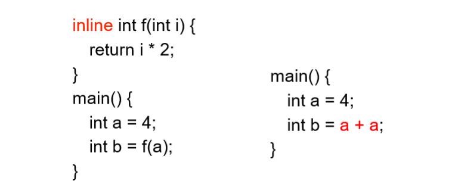
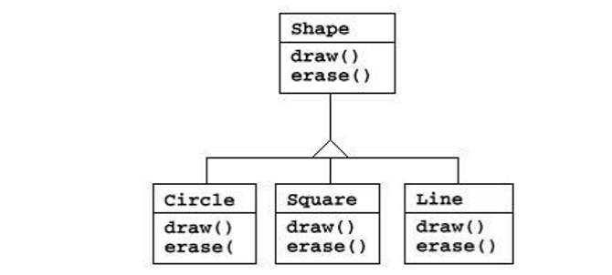
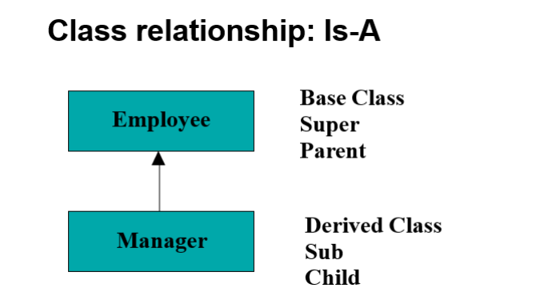
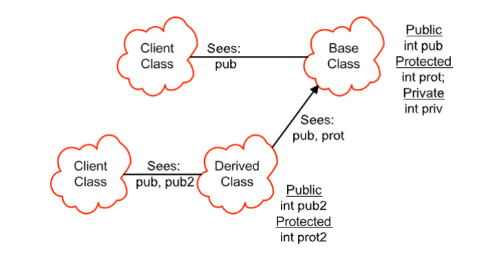
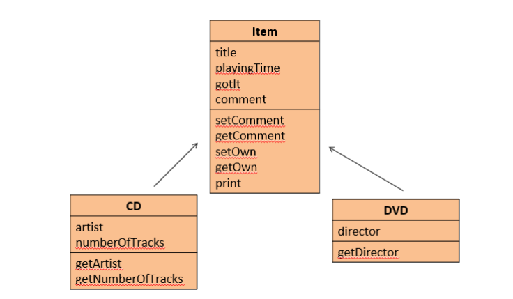
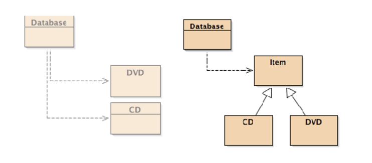
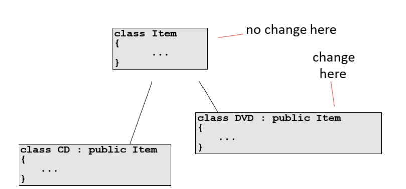
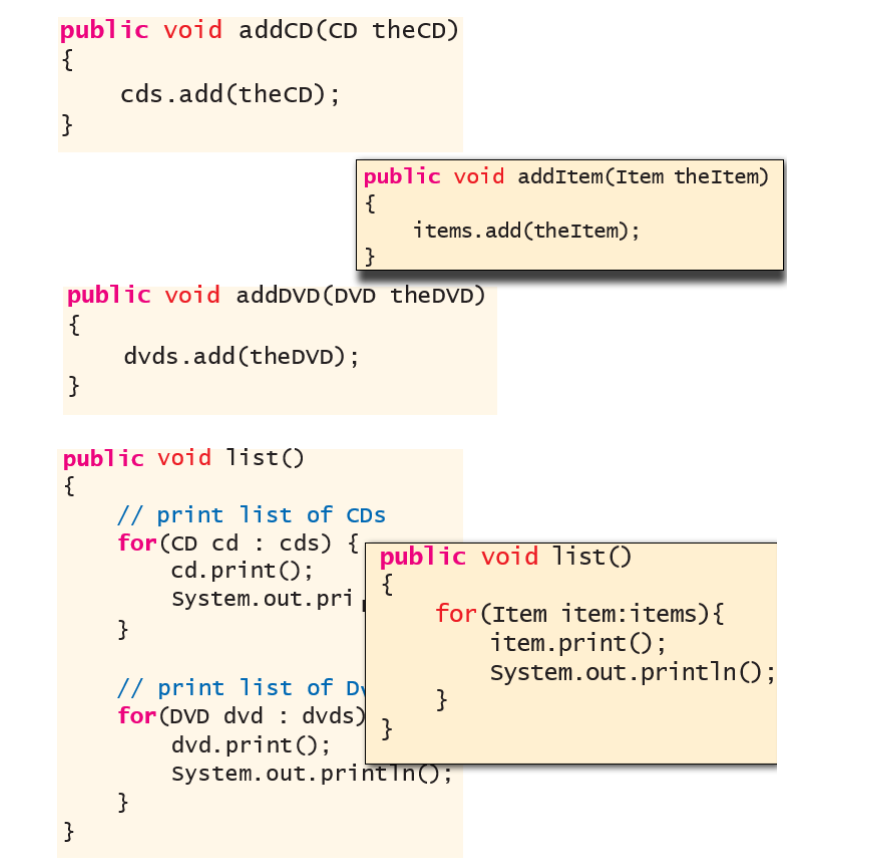
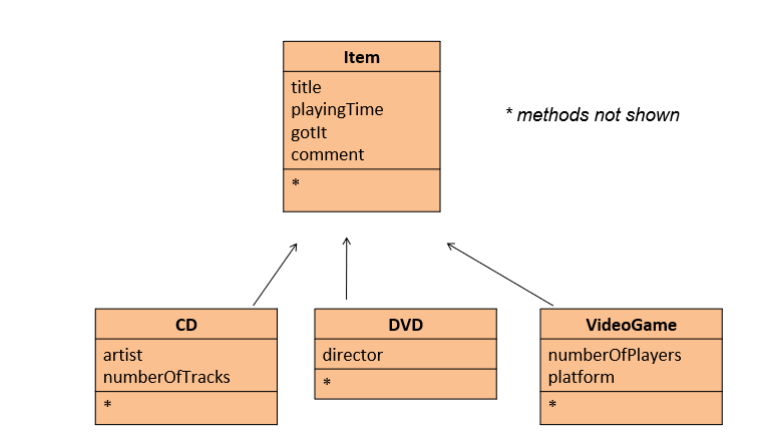

# 目录

[TOC]

# 第6章	Inline and Inheritance

## 6.1	Inline

### 6.1.1	函数调用的基本流程

(1)将参数、返回地址压栈

(2)计算返回值

(3)将栈中的所有内容出栈

### 6.1.2	inline的原理

将短函数转化为类似宏定义，在调用处将函数展开，如下图



### 6.1.3	inline的使用注意

(1)**inline**函数的**函数体**需要定义在**头文件**内

(2)**inline**的函数调用的**代码**，可能**不会在*.obj中**存在（直接被编译器在调用inline函数的地方展开了）

(3)**inline**函数是**声明**，而不是定义

(4)**inline**函数由于是直接展开，其会增加代码的长度

(5)**inline**函数是否展开，由编译器决定，当函数太大/递归，就不会展开

(6)有的编译器不实现**inline**

## 6.2	对象的组合 Composition

(1)直接在一个**class**中，实例化另一个**class**，作为自己的成员变量

(2)调用的**class**必须有**缺省构造函数**

```c++
class Person { … };
class Currency { … };
class SavingsAccount {
public:
    SavingsAccount( const char* name,
			const char* address, int cents);
    ~SavingsAccount();
    void print();
private:
    Person m_saver;
    Currency m_balance;
}; 
```

(3)注意，如果在**class**中实例化的**class**为**public**类型，子对象的接口也会暴露出去

```c++
class SavingsAccount{
public:
	Person m_saver;
	...
};// assume Person class has set_name()
SavingsAccount account;
account.m_saver.set_name("Fred");
```

## 6.3	继承 Inheritance

子类具有父类的：

​	(1)成员变量

​	(2)成员函数

​	(3)接口 **Interfaces**

**Circle**继承于**Shape**：

​	(1)先将**Shape**中的所有内容复制

​	(2)在父类的基础上，进行拓展

​	(3)父类中的成员函数可以为空

​	(4)子类和父类的**接口一致，但行为可以不一样**

​	(5)子类只能在父类的基础上加东西，不能删除父类中的东西

### 6.3.1	优点

​	(1)避免代码冗余 **Avoiding code duplication**

​	(2)代码重用 **Code reuse**

​	(3)便于维护 **Easier maintenance**

​	(4)可扩展 **Extendibility**



### 6.3.2	继承的表示方法



### 6.3.2	c++中的作用域和访问

​	(1)子类不能访问父类的**priviate**内容

​	(2)子类可见，用户不可见：**protected**




## 例：DoME

**Database of Multimedia Entertainment**

### 1	程序框图







**: public**：公有继承，父类的**public**，在子类中也是**public**

### 2	源代码



### 3	添加新的类型 VideoGame



## 例：Employee

### 1	Employee父类

```c++
class Employee {
protected:
	std::string m_name;
	std::string m_ssn;

public:
	Employee( const std::string& name,const std::string& ssn )
    : m_name(name), m_ssn( ssn){
        // initializer list sets up the values!
    }
	
    const std::string& get_name() const{
        return m_name;
    }
	
    void print(std::ostream& out) const{
        out << m_name << endl;
        out << m_ssn << endl;
    }
	
    void print(std::ostream& out, const std::string& msg) const{
        out << msg << endl;
        print(out); 
        //在子类中使用时,只会调用父类的print,而不会调用子类重定义的print
    }
};
```

### 2	Manager子类

```c++
class Manager : public Employee {//public继承
private:
    std::string m_title;

public:
    Manager(const std::string& name, const std::string& ssn, const std::string& title = "")	
    	:Employee(name, ssn), m_title( title ){//注意要调用父类的构造函数:Employee(name, ssn)
	}
    
    const std::string title_name() const{
    	return string( m_title + ": " + m_name ); 
		// access base m_name
    }
    
    const std::string& get_title() const{
    	return m_title;
    }
    
    void print(std::ostream& out) const{
        Employee::print( out ); //调用父类的函数
		out << m_title << endl;
    }

};
```

(1)父类在子类之前构造

(2)如果没有参数传递给父类，则会调用父类的缺省构造函数

(3)析构时，子类先析构，父类后析构

(4)当子类的成员函数与父类的成员函数完全一致时（函数名、参数一致），会重定义父类的成员函数

​	也就是说，当实例化一个子类时，调用该函数，只会调用子类的该函数

### 3	使用

```c++
int main () {
	Employee bob( "Bob Jones", "555-44-0000" );
	Manager bill( "Bill Smith", "666-55-1234", "ImportantPerson" );

	string name = bill.get_name(); 
    //子类继承父类的get_name()接口
	
    //string title = bob.get_title(); 
    //父类中没有get_title()接口
	
    cout << bill.title_name() << '\n' << endl;
	
    bob.print(cout);
    bill.print(cout);
	
    bob.print(cout, "Employee:");
	//bill.print(cout, "Employee:"); 
    //这里调用的是父类的print,父类的print中并没有打印title
}
```

## 6.4	重定义 Name Hiding

(1)当子类的成员函数与父类的成员函数完全一致时（函数名、参数一致），会重定义父类的成员函数

(2)如果重定义子类中的成员函数，则父类中的所有其他重定义函数都不可访问

(3)可以通过**virtual**关键字，来影响函数的重定义

## 6.5	子类没有继承的东西

(1)构造函数：构造子类时，需要调用父类的构造函数，如果没有调用，系统会默认调用父类的缺省函数

(2)析构函数

(3)赋值操作：重定义**=**时，需要调用父类的赋值操作。如果没有重定义**=**，系统会默认调用每个成员变量的赋值操作

## 6.6	访问权限

### 6.6.1	成员变量

(1)**public**：子类、用户、friends可见

(2)**protected**：子类、friends可见

(3)**private**：friends可见

### 6.6.2	继承

(1)**public**：父类中的限制是什么，子类就是什么

```c++
class Derived : public Base ...
```

(2)**protected**：父类的**public**，到子类会变成**protected**

```c++
class Derived : protected Base ...
```

(3)**private**、**default**：父类的**public**、**protected**，到子类会变成**private**

```c++
class Derived : private Base ...
```

| Inheritance Type |     public     |   protected    |   private    |
| :--------------: | :------------: | :------------: | :----------: |
|     public A     |  public in B   | protected in B | private in B |
|   protected A    | protected in B | protected in B | private in B |
|    private A     |  private in B  |  private in B  | private in B |
