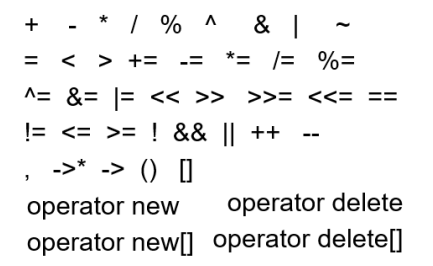
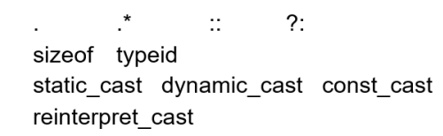

# 目录

[TOC]

# 第8-1章	Container

## 8.1	STL

### 8.1.1	STL定义

(1)STL = Standard Template Library

(2)是ISO Standard C++ Library的一部分

(3)包含C++实现的数据结构、算法

### 8.1.2	STL的三个部分

(1)**Containsers**：容器

(2)**Algorithms**：算法

(3)**Iterators**：迭代器

## 8.2	顺序访问的容器

(1)**vecotor**：可变长数组

(2)**deque**：双向队列

(3)**list**：双向链表

(4)**forward_list**

(5)**array**

(6)**string**：字符数组

### 8.2.1	vector

```c++
#include <vector>
using namespace std;

//定义及初始化
vector<Elem> c;
vector<Elem> c1(c2);
vector<int> v(100); //预分配100个元素的内存地址

//方法
v.size();
v.empty();
==,!=,>,<,<=,>-;
v.swap(v2);

//迭代器
v.begin();
v.end();
vector<int>::iterator p;
for(p=v.begin();p<x.end();p++)
    cout << *p << endl;

//获取元素
v.at(index);
v[index];
v.front();
v.back();

//添加，删除，查找
v.push_back(e);
v.pop_back();
v.insert(pos,e);
v.erase(pos);
v.clear();
v.find(first,last,item);
```

### 8.2.2	list

```c++
#include <list>
#include <string>
using namespace std;

//定义及初始化
list<string> s;
list<string> s1(s2);

//迭代器
s.begin();
s.end();
list<string>::iterator p;
for(p=s.begin();p!=s.end();p++)
    cout << *p << endl;

//获取元素
s.front();
s.back();

//添加，删除，查找
s.push_back("hello");
s.push_front("world");
s.pop_back();
s.pop_front();
s.insert(pos,item);
s.remove(item);
s.erase(pos);
```

## 8.3	Map

**Map**是一个**pair**的集合，包含**key**和**value**

查找：需要一个**key**，返回一个**value**

```c++
#include <map>
#include <string>
using namespace std;

//定义
map<string,double> price;

//插入
price["snapple"] = 0.75;
price["coke"] = 0.50;

//查找
string item;
double item_price;
item_price = price[item];

//计算item在map中出现的次数
price.count(item);
```

## 8.4	Iterator 迭代器

```c++
//定义
list<int>::iteator it;

//容器的开头
L.begin();

//容器的结尾
L.end();

//迭代器的迭代
++it;

//dereferenced
*it = 10;
```

## 8.5	标准方法

### 8.5.1	copy

```c++
//将L中的每个元素,送到cout输出流中
copy(L.begin(), L.end(), ostream_iterator<int>(cout,","));

//将L中的值放到V里面
copy(L.begin(),L.end(),V.begin());
```

## 8.6	typedef

```c++
//不使用typedef的声明
map<Name, list<PhoneNum> > phonebook;
map<Name, list<PhoneNum> >::iterator finger;

//使用typedef
typedef PB map<Name,list<PhoneNum> >;
PB phonebook;
PB::iterator finger;
```

## 8.7	将自己的class放入STL容器

(1)需要：赋值操作**operator = ()**，缺省构造函数

(2)对于排序类型：需要**operator < ()**

# 第8-2章	Overload Operator

## 8.1	操作符重载

### 8.1.1	可以重载



### 8.1.2	不能重载



### 8.1.3	注意

(1)不能重载不存在的操作符

(2)操作符的顺序不能改变

## 8.2	重载的语法

### 8.2.1	作为成员函数

可以作为类的成员函数，隐藏调用的对象

1.   返回值必须是该类的类型
2.   必须能够得到类的定义

```c++
class Integer{
private:
    int i;
public:
    Integer(int n=0):i(n){};
    const Integer operator+(const Integer& n)const{
        return Integer(i + n.i);
    }
    const Integer operator-()const{
        return Integer(-i);
    }
}
Integer x(1),y(5),z;
z = x + y; //√
z = x + 3; //√,3作为参数传入,会被转化为Integer
z = 3 + y; //×
```

### 8.2.2	作为global函数

也可以是一个**global**函数，此时必须写出两个对象

1.   不需要特殊的访问**class**
2.   可能需要定义为**friend**函数，使其能够访问**private**变量
3.   两个参数都可以进行类型转换

```c++
class Integer{
    friend const Integer operator+(const Integer& rhs,const Integer& lhs);
}
const Integer operator+(const Integer& rhs,const Integer& lhs){
    return Integer(lhs.i + rhs.i);
}
Integer x(1),y(5),z;
z = x + y; //等价于z = operator+(x,y)
z = 3 + y; //√
```

### 8.2.3	必须是成员函数的重载

1.   单目运算符
2.   **=、()、[]、->、***

## 8.3	作为global函数的operator

1.   如果是一个**read-only**的传递，必须声明为**const &**
2.   如果成员函数定义为**const**，则不能修改成员变量的值
3.   对于**global**函数左边的参数需要会作为引用传递
4.   返回值，要根据操作符本身的意思来定，并且要定义为**const**
     1.   如果不定义成**const**，可能会出现：**x+y=z**的情况
     2.   逻辑运算的返回值要定义成**bool**

```c++
//+ - * / % ^ & | ~
const T operator X (const T &l, const T &r)const{
    
}
//! && || < <= == >= >
bool operator X (const T &l, const T &r)const{
    
}

```

## 8.4	作为成员函数的operator

### 8.4.1	下标

```c++
//[]
E& T::operator[](int index){
    
}
```

### 8.4.2	++和--操作

```c++
class Integer{
public:
    const Integer& operator++(){ //++i,返回的是对自己的引用
        *this += 1;   //先自增
        return *this; //再返回新的自己
    }
    const Integer operator++(int){ //i++,返回的是临时对象
        Integer old( *this ); //先保存旧的自己
        ++(*this);			  //再自增
        return old;			  //最后返回旧的自己
    }
    const Integer& operator--(); //--i
    const Integer operator--(int); //i--
};

Integer x(5);
++x; //调用x.operator++();
x++; //调用x.operator++(0);
--x; //调用x.operator--();
x--; //调用x.operator--(0);
```

### 8.4.3	bool操作

```c++
class Integer { 
public: 
    bool operator==(const Integer& rhs) const; 
    bool operator!=(const Integer& rhs) const; 
    bool operator< (const Integer& rhs) const; 
    bool operator> (const Integer& rhs) const; 
    bool operator<=(const Integer& rhs) const; 
    bool operator>=(const Integer& rhs) const; 
}
```

1.   使用 **==** 实现 **!=**
2.   使用 **<** 实现 **>,>=,<=**

```c++
bool Integer::operator==( const Integer& rhs ) const { 
   return i == rhs.i; 
} 
// 使用 !(*this == rhs) 实现 *this != rhs
bool Integer::operator!=( const Integer& rhs ) const { 
   return !(*this == rhs);  
}
bool Integer::operator<( const Integer& rhs ) const { 
   return i < rhs.i; 
}
// 使用 rhs < *this 实现 *this > rhs
bool Integer::operator>( const Integer& rhs ) const { 
   return rhs < *this; 
} 
// 使用 !(rhs < *this) 实现 *this <= rhs
bool Integer::operator<=( const Integer& rhs ) const { 
   return !(rhs < *this); 
} 
// 使用 !(*this < rhs) 实现 *this >= rhs
bool Integer::operator>=( const Integer& rhs ) const { 
   return !(*this < rhs); 
}
```

### 8.4.5	赋值

1.   要返回引用类型，因为可能会存在**A=B=C=D**
2.   当**A**与**this**的地址相同时，说明是**A=A**，可以不用执行赋值操作
3.   对于具有动态分配内存的类，系统的默认赋值只能进行浅拷贝，也就是说，会出现后面的实例中指针指向了前面的示例的指针指向的地址。因此要写赋值操作
4.   如果不想出现赋值操作，可以将**operator=**声明为**private**

```c++
class T{
public:
    T& operator=(const T& A){
        if(&A != this){
            //执行赋值操作
        }
		return *this;
    }
}
```

## 8.5	copy vs initialization

```c++
MyType b;
MyType a = b; //initialization,调用了MyType()构造函数
a = b; //copy,调用了operator=
```

**initialization**：

1.   会调用**MyType**的构造函数
2.   如果没有对应类型的构造函数，则会进行类型转换

**copy**：

1.   会调用**MyType**的**operator=**
2.   如果没有写**operator=**，系统会有一个缺省构造函数，默认调用所有成员变量的**operator=**

## 8.6	流操作 stream extractor

1.   返回**&**，因为输入/输出**obj**后，输入/输出流会变化

```c++
istream& operator>>(istream& is, T& obj){
    // 从输入流is中,读取obj的值
    return is;
}
cin >> a >> b >> c;
((cin >> a) >> b) >> c;

ostream& operator<<(ostream& os, const T& obj) {
	// 将obj的值,写入输出流os
	return os; 
}
cout << a << b << c;
((cout << a) << b) << c;
```

### 8.6.1	定义 manipulators

```c++
// output stream manipulator的框架
ostream& manip(ostream& out) {  
   ... 
   return out; 
} 
ostream& tab (ostream& out) { 
   return out << '\t'; 
} 
cout << "Hello" << tab << "World!" << endl;
```

## 8.7	类型转换

1.   类型转换操作符，可以将一个类的对象转化为
     1.   另一个类的对象
     2.   内置类型**built-in type**

```c++
class Rational { 
public: 
   operator double() const{
       return numerator_/(double)denominator_; 
   }
} 
Rational r(1,3); 
double d = 1.3 * r; // r=>double
```

2.   编译器可以自动执行的类型转换
     1.   单参数的类型转换**single argument**
     2.   隐式类型转换**implicit type**：如子类→父类，在构造函数中定义的类型转换

```c++
class PathName{
    string name;
public:
    PathName(const string&);
}
string abc("abc");
PathName xyz(abc);
xyz = abc;  //OK,编译器会调用构造函数PathName(const string&)，将abc类型转换为PathName
```

3.   防止**implicit conversion**
     1.   添加关键字**explicit**，显式调用

```c++
class PathName { 
   string name; 
public: 
  explicit PathName(const string&); 
}; 
... 
string abc("abc"); 
PathName xyz(abc); // OK! 
xyz = abc;    // error! 

```

内置类型转换：

1.   原始类型

     char → short → int → float → double

     ​						→ int → long

2.   隐式类型转换

     1.   T → T&
     2.   T& →  T
     3.   T* →  void*
     4.   T[] →  T*
     5.   T* →  T[]
     6.   T →  const T[]

用户定义的类型转换：**T→C**

1.   判断**C**的构造函数中是否存在**C(T)**
2.   判断**T**的重载中是否存在**operator C()**

## 8.8	casting operator

出错信息：bad cast

### 8.8.1	static_cast

显式类型转换，为了保证操作符转换的安全性

不允许const 指针/引用 → 非const

```c++
char a = 'a';
int b = static_cast<char>(a);//correct

double *c = new double;
void *d = static_cast<void*>(c);//correct

int e = 10;
const int f = static_cast<const int>(e);//correct

const int g = 20;
int *h = static_cast<int*>(&g);//error: static_cast can not remove the const property
```

但是当用来转化class指针的时候，static_cast不是安全的，因为它不会检查两个class的继承关系

```c++
Class A {public: virtual test() {…}}

Class B: public A {public: virtual test() {…}}

A *pA1 = new B();
B *pB = static_cast<B*>(pA1);  //downcast not safe
```

### 8.8.2	dynamic_cast

会检查向下转换 downcast 是否为安全的

```c++
Class A {public: virtual test() {…}}

Class B: public A {public: virtual test() {…}}

Class C: {public: virtual test() {…}}

A *pA1 = new B();
B *pB = dynamic_cast<B*>(pA1);  //safe downcast

C *pC = dynamic_cast<B*>(pA1);  //not safe, will return a NULL pointer
```

### 8.8.3	const_cast

const 指针/引用 → 为非const

```c++
const int g = 20;
int *h = const_cast<int*>(&g); //correct

const int g = 20;
int &h = const_cast<int &>(g); //correct

const char *g = "hello";
char *h = const_cast<char *>(g); //correct
```

### 8.8.4	reinterperet_cast

指针 → int，int → 指针

```c++
int a, b;
int *pA = &b;
a = reinterpret_cast<int>(pA); //correct
pA = reinterpret_cast<int*>(a);  //correct

b = reinterpret_cast<int>(a);  //Error, can not be used to convert int to int
```

