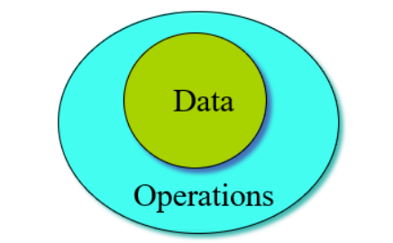
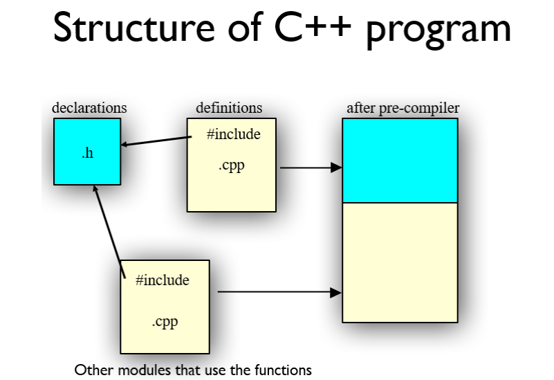
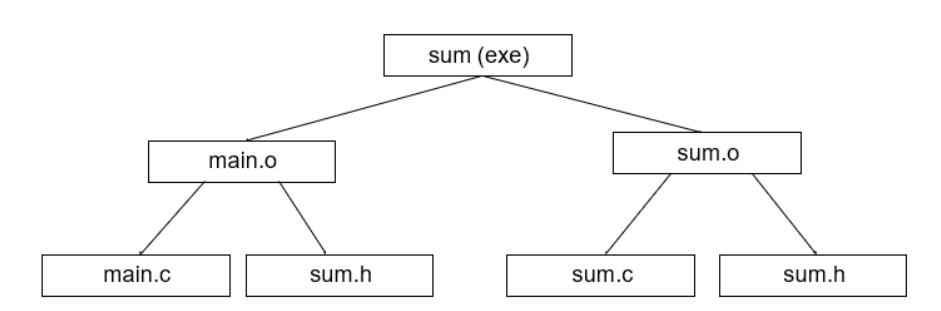
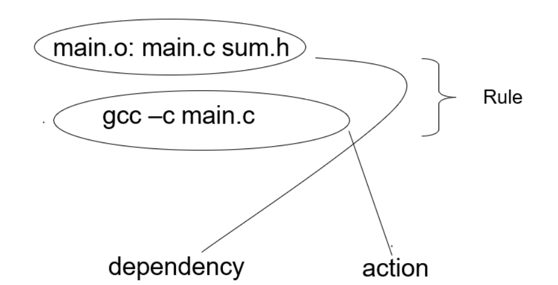

# 目录

[TOC]

# 三、class

## 3.1	C语言–面向过程

1. 定义：定义结构体、对结构体的操作函数
2. 使用：传入结构体指针、对应的参数

```c
// 定义
typedef struct point {  
    float x;
	float y;
}Point;
void print(const Point *p){
    printf("%f %f\n",p->x,p->y);
}
void move(Point* p,int dx,int dy){
    p->x += dx; p->y += dy;
}
// 使用
Point a;
a.x = 1;a.y = 2;
move(&a,2,2);
print(&a);
```

## 3.2	C++语言–面向对象

1. 定义：将**对象**和**操作**绑定到一起
2. 使用：操作Point对象

```c++
// 定义
class Point{
public:
    void init(int x,int y);
    void move(int dx,int dy);
    void print()const;
    
private:
    int x;
    int y;
}
// 实现
void Point::init(int ix,int iy){
	x = ix; y = iy;
}
void Point::move(int dx,int dy){
    x += dx; y += dy;
}
void Point::print() const{
    cout << x << ' ' << y << endl;
}
// 使用
Point a;
a.init(1,2);
a.move(2,2);
a.print();
```

## 3.3	:: resolver

**< Class Name >::< function name >**

**::< function name >**

```c++
void S::f(){
	::f();//这里调用的f()是全局的函数f(),而非自己
    ::a++;//全局的a++
    a--;//S里的a++
}
```

## 3.4	Container容器

**container**：是一个能够保存其它对象的**object**

**stash**：是一个可以存储变量、运行时可以扩展的**container**

要求：

1. 无类型限制
2. 存储的对象类型相同
3. 操作：**add()**、**fetch()**
4. 可以自动扩展内存

### 3.4.1	声明

```c++
#ifndef STASH2_H
#define STASH2_H
class Stash{
    int size;	 // 每个空间的大小
    int quantity;// 空间的个数
    int next;	 // 下一个为空的空间
    
    // 进行动态内存访问
    unsigned char* storage; 
    void inflatte(int increase);// 增长内存
public:
    Stash(int size);
    ~Stash();
    int add(void * element);
    void* fetch();
    int count();
};
#endif
```

### 3.4.2	定义

```c++
#include "Stash2.h"
#include "../require.h"
#include <iostream>
#include <cassert>
using namespace std;
const int increment = 100;

// 构造函数,函数名和类名相同
Stash::Stash(int sz) { 
	size = sz;
	quantity = 0;
	storage = 0;
	next = 0;
}
int Stash::add(void* element) {
    // 剩余内存不够,增加内存
	if(next >= quantity) 
		inflate(increment);
	// 将元素复制到storage[]中,开始另一个新内存
	int startBytes = next * size;
	unsigned char* e = (unsigned char*)element;
	for(int i = 0; i < size; i++)
		storage[startBytes + i] = e[i];
	next++;
	return (next - 1); //当前元素存储的空间编号
}

void* Stash::fetch(int index) {
	require(0 <= index, "Stash::fetch (-)index");
    
	if(index >= next) return 0;// 访问为空
	// 返回访问的内存地址
	return &(storage[index * size]);
}

int Stash::count() {
	return next; // Stash中的元素个数
}

void Stash::inflate(int increase) {
	require(increase > 0, "Stash::inflate zero or negative increase");
    
	int newQuantity = quantity + increase;
	int newBytes = newQuantity * size;
	int oldBytes = quantity * size;
	unsigned char* b = new unsigned char[newBytes];
	for(int i = 0; i < oldBytes; i++)
		b[i] = storage[i]; // 将旧内存中的元素复制到新内存中
	delete[] (storage); // 删除旧内存
	storage = b; // storage指向新内存
	quantity = newQuantity;
}

// 析构函数
Stash::~Stash() {
	if(storage != 0) {
    	cout << "freeing storage" << endl;
    	delete[] storage;
	}
}
```

## 3.5	this

**this**：指向对象本身的指针，是类的每个成员函数的隐藏参数

```c++
void Stash::initialize(int sz);
// 可以被视为: 
void Stash::initialize(Stash* this, int sz);

Stash a;
a.initialize(10);
// 可以被视为: 
Stash::initialize(&a, 10);
```

```c++
class MyClass{
    int x;
    int y;
public:
    MyClass(){x = 0; y = 0;}
    void foo(int x, int y){
        this->x = x;
        this->y = y; // 在运行时,this会被看为指向该对象的一个指针
    }
};
```

## 3.6	Object & class

**Objects = Attributes + Services**

1. data：对象的特性or状态；operations：对对象的操作
2. 通过接口修改数据，而非直接修改数据
3. 直接访问变量，变量的声明者对变量没有控制权，无法控制操作者的行为



**class**定义**object**，**object**是**class**的一个实例

1. class表述对象可能具有哪些特性
2. object表示当前对象的每个特性的具体取值

OOP的特性：

1. 所有事物均可以看作一个对象object
2. 程序是对象的集合，他们通过互相发送消息，告知应该做些什么
3. 每个对象都有自己独有的内存空间，由其他更加通用的对象组成
4. 每个对象都有一个类型type
5. 一个特定类型的所有对象，可以收到相同的信息

## 3.7	Definition of a class

1. **class**的声明放入**.h**文件
2. **class**的函数体、静态成员变量放入***.cpp**文件

## 3.8	compile unit

1. **compiler**只会看到当前的**cpp**文件，生成当前文件对应的 **obj**文件
2. **linker**会链接所有的**obj**文件，生成一个 **exe**文件
3. 如果要使用其它**cpp**文件中定义的函数/类，需要使用 **.h**头文件进行声明

## 3.9	The header files

1. 如果函数定义在头文件，那么必须在任何使用该函数和定义该函数的地方**include**该头文件
2. 如果**class**定义在头文件，那么必须在任何使用**class**和定义**class**的地方**include**该头文件
3. 当使用`#include`引用头文件时，编译器会将头文件的内容展开到当前文件，相当于将函数/类的声明写入了当前**cpp**文件中



## 3.10	Makefile

- 当程序的代码量过大时，如果仅使用单个文件，会导致诸如难以管理、单次修改需要编译整个项目等问题
- 因此我们需要将代码拆分为多个文件进行管理与修改
- 多个代码文件之间的关系，通过Makefile文件声明

### 3.10.1	Project的结构

可以看作是一个有向无环图**DAG**

以一个工程为例

- 包含main.c、sum.c、sum.h
- sum.h在所有.c文件中都包含



此时的**makefile**为：

```makefile
sum: main.o	sum.o
	gcc –o sum main.o sum.o
main.o: main.c sum.h  
    gcc –c main.c
sum.o: sum.c sum.h  
    gcc –c sum.c
```

### 3.10.2	makefile的语法规则：



简化语法：

```makefile
sum: main.o	sum.o
	gcc –o $@ main.o sum.o # $@ ==> sum
main.o	sum.o: sum.h  
    gcc –c $*.c # $* ==> main、sum
```

### 3.10.3	makefile的过程

1. 构建项目依赖树
2. 创建第一条指令的目标，当且仅当一下两种情况成立之时：
   1. 目标文件不存在
   2. 目标文件比它的一个依赖项更早生成
3. **makefile**的作用是保证最小的编译数量，因此需要正确写明
   1. 不要写成下面这样(这样写会直接重新编译所有文件)

```makefile
prog: main.c sum1.c	sum2.c
gcc –o prog main.c sum1.c sum2.c
```

## 3.11	CMake

1. 是一个跨平台的，开源编译系统
2. 可以看作是Makefile的升级版

[cmake学习笔记 | 华风夏韵 (hzoi-unicorn.top)](https://hzoi-unicorn.top/2023/06/02/指令合集/cmake学习笔记/)

